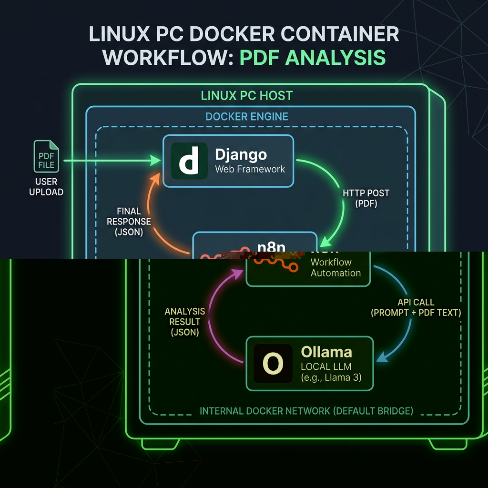

# 📄 PDF Analyzer – n8n + Django

This project lets you upload a PDF file and analyze it using Ollama, n8n workflow connected to a Django backend.
The entire environment runs in Docker, so you don’t need to install Python, n8n, or any other tools manually.


        
## 🧩 What’s inside?

* **docker-compose.yml** – Starts both the Django app and n8n.
* **pdfanalyze/** – The Django application (ready to run inside its own Docker container).
* **n8n-pdf-analyzer.json** – A pre-built n8n workflow that you can import with one click.


## 🖥️ Prerequisites

You only need to have **Docker** and **Docker Compose** installed on your computer.

* **Windows / macOS:** Install Docker Desktop
* **Linux:** Install Docker Engine and Docker Compose via your package manager.

After installation, verify they are working by opening a terminal and typing:

```bash
docker --version
docker compose --version
```

Both should show version numbers without errors.


## 🚀 Quick Start

1. **Download or clone this repository** to your computer.

3. **Open a terminal and navigate to project folder , likely something like 'django-n8n-pdf-analysis-main' :**

```bash
cd /path/to/django-n8n-pdf-analysis-main
```

3. **Start everything with a single command:**

```bash
docker-compose up -d
```

4. Wait until both services are ready.
   You can check the logs with:

```bash
docker-compose logs -f
```
Press **Ctrl + C** to stop watching the logs (the services keep running).

5. After starting the containers, you pull the llama3.1 model into the running Ollama container:
   The first time you run it, Docker will download the necessary images (this may take a few minutes).
   After that, you’ll see the containers start.

   **Find the container name (if you don't know it), by running:**
   `docker ps`

   **Then pull the model, by running:**
   `docker exec -it <container-name> ollama pull llama3.1`


## 🌐 Access the services

* **n8n:** http://localhost:5678
* **Django (backend):** http://localhost:8000

Open these URLs in your browser.


## 📥 Import the n8n workflow

1. Open n8n: http://localhost:5678
2. Create an account.
3. Create new workflow.
5. Click the **“Import from File”** button , top right (or the three dots menu → *Import*).
6. Choose the file **`n8n-pdf-analyzer.json`** from your project folder.
7. The workflow will appear. Click **Save** (top right) to keep it.


## 🧪 How to use the workflow

The imported workflow expects a PDF file to be placed in a specific location.
A sample PDF (`remaarks.pdf`) is already inside the Django app folder:

```
pdfanalyze/pdfanalyze/remaarks.pdf
```

### To run the analysis

1. In n8n, open the workflow.
2. Make sure you activate your workflow by clicking on 'publish'
4. Go back to your project, navigate to the django folder , which is the inner folder  *`pdfanalyze`*
5. Click **Execute Workflow** (the play button), and copey the generated link
6. Open terminal and execure `curl -F "data=@testfile.pdf" http://localhost:5678/webhook-test/pdf-analyze`
7. Note : `http://localhost:5678/webhook-test/pdf-analyze` is the webhook generated link
8. The workflow will read the PDF, send it to the Django endpoint, and display the result.

If you want to use **your own PDF**, simply replace the file at:

```
pdfanalyze/pdfanalyze/testfile.pdf
```

Keep the same filename or adjust the workflow node accordingly.

💡 **Tip:** If you change the filename, update the **“Read File”** node in the n8n workflow.


## 🛑 Stopping the services

To stop the containers:

```bash
docker-compose down
```

To stop and remove all data (including n8n’s database):

```bash
docker-compose down -v
```
